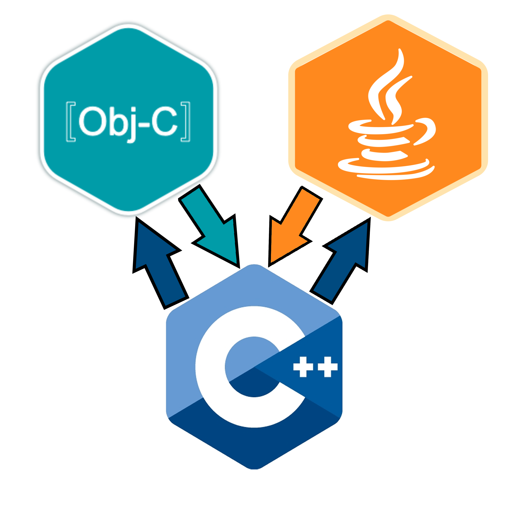
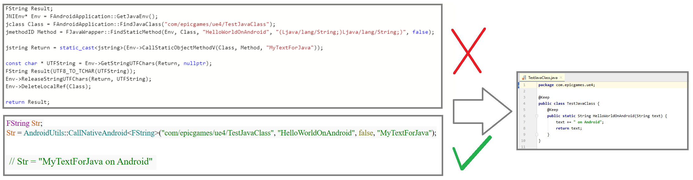
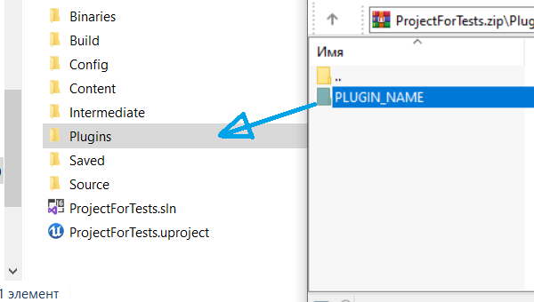
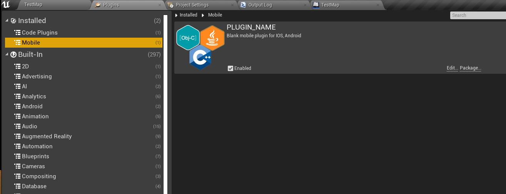
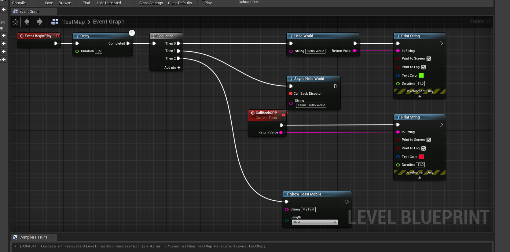

# Mobile Native Code Plugin for Unreal Engine 4

**(*Rus*)** **Mobile Native Code Plugin** - служит основой для собственного мобильного плагина в Unreal Engine 4 для платформ Android и IOS. В нём реализован удобный вызов нативного кода Java(JNI) и Objective-c, а также примеры подключения статических и динамических библиотек в систему сборки. Просто переименуйте все названия *PLUGIN_NAME* во всех папках и файлах на собственные и получите нужный вам плагин.

*Нативный код Objective-C для IOS скоро появится*.
* **Требуется Unreal Engine 4.21 или выше.**

**(*Eng*)** **Mobile Native Code Plugin** - serves as the basis for the native mobile plugin in Unreal Engine 4 for Android and IOS platforms. It provides a convenient call to native Java code(JNI) and Objective-c, as well as examples of connecting static and dynamic libraries to the build system. Just rename all the *PLUGIN_NAME* names in all folders and files to your own and get the plugin you need.

 *Native Objective-C code for IOS is coming soon*.
* **Requires Unreal Engine 4.21 or higher.**

## Особенности / Features

**(*Rus*)**
* Собирается на ndk-14 и ndk-21 для Android
* Вызов нативного кода Java одной функцией из C++
* Visual Studio нужен для сборки плагина

**(*Eng*)**
* Builds on ndk-14 and ndk-21 for Android
* Calling native Java code with a single function from C++
* Visual Studio is needed to build the plugin
## Установка / Setup
### **(*Rus*)**
1) Скопируйте *PLUGIN_NAME* в папку *Plugins*, расположенную в главном пути вашего проекта (Если её нет, то создайте).

2) Включите *PLUGIN_NAME* в *Edit -> Plugins -> Installed -> Mobile-> PLUGIN_NAME*.

3) В LevelBlueprint уровня создайте схему.

 4) **Запустите на вашем мобильном устройстве (IOS пока не поддерживается).**
 
### **(*Eng*)**
1) Copy the *PLUGIN_NAME* folder *Plugins* are located in the main path of your project (If not, then create).

2) Turn on the *PLUGIN_NAME* is *Edit -> Plugins -> Installed -> Mobile-> PLUGIN_NAME*.

3) in the LevelBlueprint level, create a diagram.

4) **Run on your mobile device (IOS is not supported yet).**
# Тестирование / Testing

* *Unreal Engine 4.24* - **Nexus 5** - *OpenGL ES2* - *armeabi-v7a* - **ndk-r14b**

* *Unreal Engine 4.25* - **Honor Play** - *OpenGL ES3.1* - *arm64-v8a* - **ndk-r21b**

# Дополнительная информация / Additional information

## (RUS) Для Android
Для вызова собственного Java класса:

* Добавьте свой Java класс в папку *PLUGIN_NAME\Source\PLUGIN_NAME\Private\Android\Java*
		
* Измените *package* на: **package com.epicgames.ue4;**
 
* Класс должен быть публичным (*public class*), а его функции статичными (*public static void*)

* Перед классом и функциями добавьте *@Keep*

* Перейдите в *\PLUGIN_NAME\Source\PLUGIN_NAME\Private* и откройте *PLUGIN_NAMEBPLibrary.cpp*.
  В данном файле продемонстрированы 3 функции для вызова Java кода.

* Java код вызывается с помощью **AndroidUtils::CallNativeAndroid< ReturnType >("com/epicgames/ue4/YourClass", "YourFunction", false, "arg1","arg2","arg3")**, если функция что-то возвращает.

   В случае если Java функция ничего не возвращает (Void) то вызывается **AndroidUtils::CallNativeAndroidVoid("com/epicgames/ue4/YourClass", "YourFunction", false, "arg1","arg2","arg3")**

* *ReturnType* указывается в зависимости от возвращаемого типа. *1 аргумент* это package+название вашего класса, *2 аргумент* название вашей функции, *3 аргумент* указывает - нужно ли передать Activity данного сеанса. Далее кол-во аргументов может быть передано сколько угодно, в зависимости от того, что принимает ваша функция.

* Если ваша Java функция принимает специфичный тип (напр. *jobject*), то перед вызовом функции **CallNativeAndroid** нужно вашу C++ переменную предварительно конвертировать в *jobject*. Больше информации о конвертации можно найти в файле *PLUGIN_NAME\Source\PLUGIN_NAME\Private\Android\Utils\JavaConvert.cpp*

* Асинхронный вызов Java происходит посредствам диспетчеров - код Java вызывает функцию C++, которая в свою очередь активирует его.

* (**Не рекомендуется**) Вы можете указывать свой *package* для Java классов. 
Перейдите в *PLUGIN_NAME\Source\PLUGIN_NAME\ThirdParty\Android* и в файлах *AndroidV24.xml* (*Если UE4.21-UE4.24*) и *AndroidV25.xml* (*Если UE4.25 и Выше*) укажите новый путь копирования и объявление своего класса.

* При добавлении нового Java класса или изменении текущего - удаляйте папку **Intermediate** в папке вашего проекта.

## (ENG) for Android
To call your own Java class:

* Add your Java class to the folder *PLUGIN_NAME\Source\PLUGIN_NAME\Private\Android\Java*

* Change the value of *package* at: **package com.epicgames.ue4;**

* The class must be public (*public class*) and its functions must be static (*public static void*)

* before the class and functions, add ***@Keep***

* Go to *PLUGIN_NAME\Source\PLUGIN_NAME\Private* and open *PLUGIN_NAMEBPLibrary.cpp*.
This file demonstrates 3 functions for calling Java code.

* Java code is called using **AndroidUtils:: CallNativeAndroid< ReturnType >("com/epicgames/ue4/YourClass", "YourFunction", false, "arg1","arg2", "arg3")** if the function returns something.

  If the Java function returns nothing (Void) then called **AndroidUtils:: CallNativeAndroidVoid ("com/epicgames/ue4/YourClass", "YourFunction", false, "arg1", "arg2", " arg3")**

* *ReturnType* is specified depending on the return type. *1 argument* is package+the name of your class, *2 argument* the name of your function, *3 argument* indicates whether to pass the activity of this session. Further, the number of arguments can be passed as many as you want, depending on what your function accepts.

* If your Java function accepts a specific type (e.g. * jobject*), then before calling the **CallNativeAndroid function** you need to convert your C++ variable to *jobject* first. More information about conversion can be found in the file *PLUGIN_NAME\Source\PLUGIN_NAME\Private\Android\Utils\JavaConvert.cpp*

* Asynchronous Java invocation occurs through dispatchers UE4 - Java code calls a C++ function, which in turn activates it.

* (**Not recommend**) You can set the value of *package* for Java classes.
Go to *PLUGIN_NAME\Source\PLUGIN_NAME\Third Party\Android* and in files *AndroidV24.xml* (*If UE4. 21-UE4. 24*) and *AndroidV25.xml* (*If UE4. 25 and Higher*) specify the new copy path and your class Declaration.

* When adding a new Java class or changing the current one, delete the **Intermediate** folder in your project folder.

## Для iOS
* **(*RUS*)** Нативный код Objective-C для IOS скоро появится...
## For iOS
* **(*ENG*)** Native Objective-C code for IOS is coming soon...