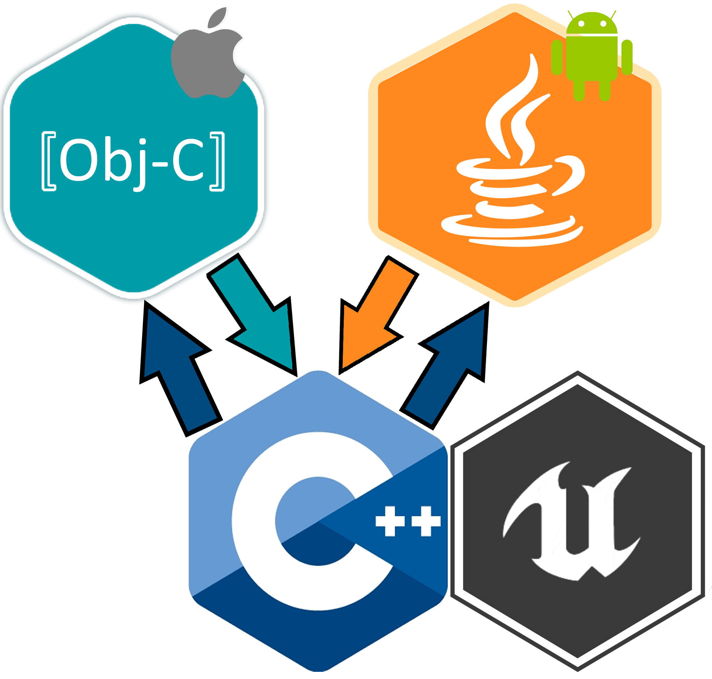
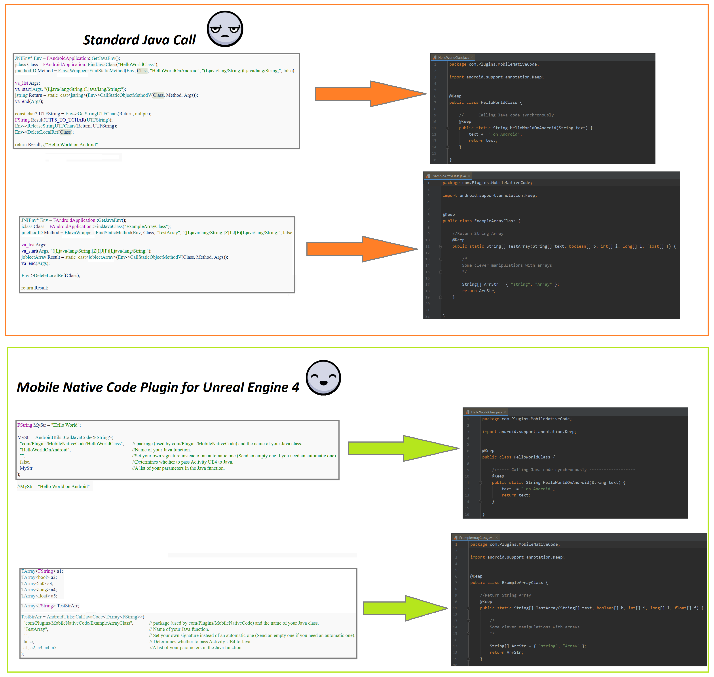
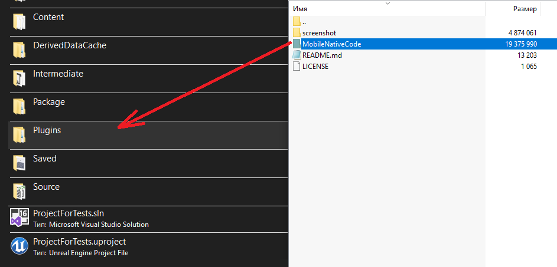
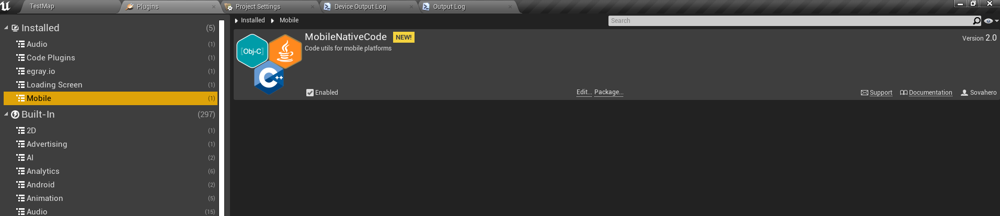
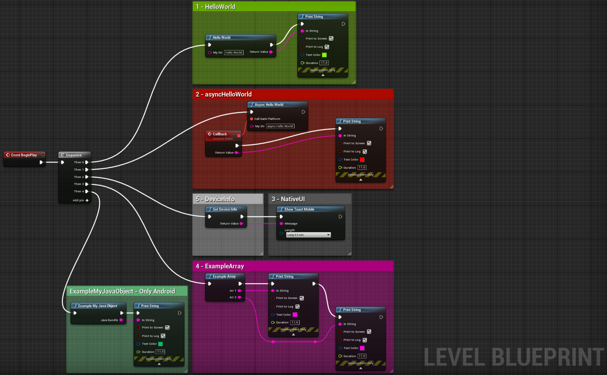
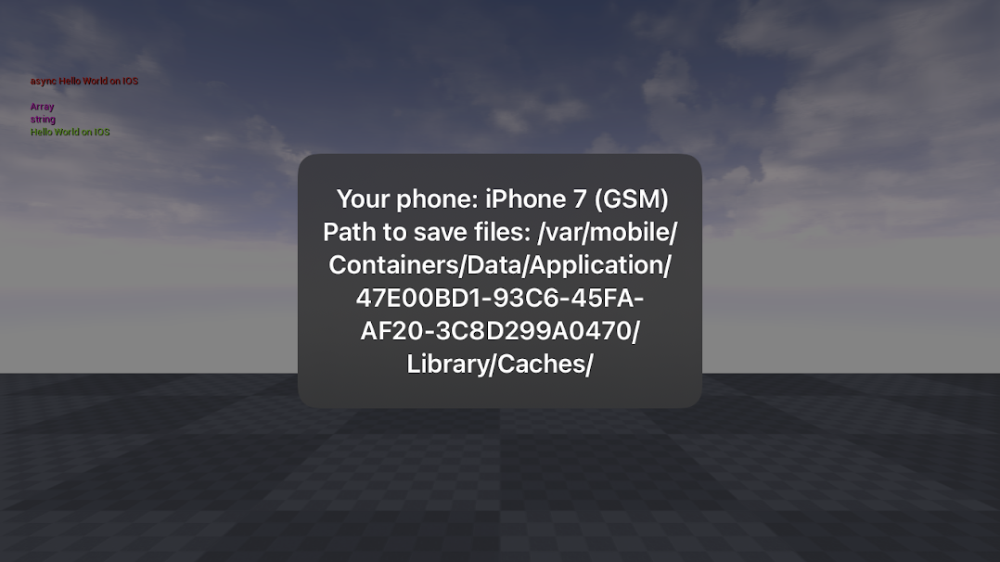
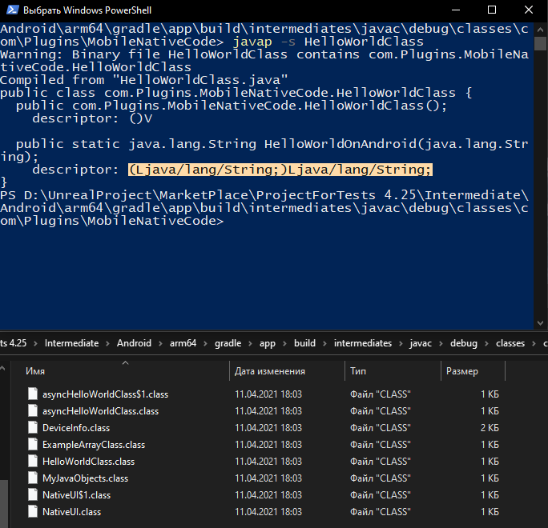
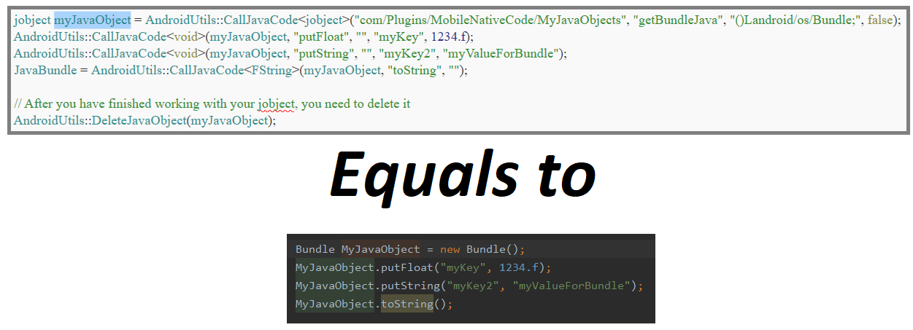
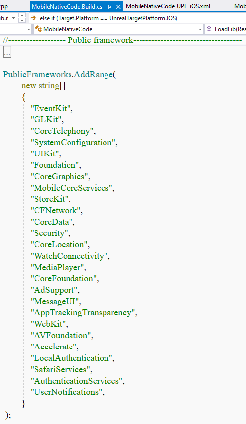

# Mobile Native Code Plugin for Unreal Engine 4
When developing a mobile application based on Unreal engine 4, you often need to get access to functionality that is not available in C++/Blueprint. For example:
* Get absolute paths to temporary folders to save your own files
* Read information from sensors (Accelerometer, Barometer, etc.)
* Get information about the phone
* Interact with other apps
* Connect different advertising and analytics services (Facebook, Firebase, Admob)

**Mobile Native Code Plugin** - Serves as the basis for the native mobile plugin in Unreal Engine 4 for Android and iOS platforms. It provides a convenient call to native Java code(JNI) and Objective-C, as well as examples of connecting static and dynamic libraries to the build system. Add it to your project and start expanding it with your features.

# Features

* Requires Unreal Engine 4.21 or higher.
* Builds on ndk-14 and ndk-21 for Android
* Calling native Java code with a single function from C++
* Examples of functions for interacting with native code
Located on the path:
> **Blueprint\C++** - MobileNativeCode\Source\MobileNativeCode\Private\MobileNativeCodeBlueprint.cpp

 > **Android** - MobileNativeCode\Source\MobileNativeCode\Private\Android\Java\

> **IOS** - MobileNativeCode\Source\MobileNativeCode\Private\IOS\ObjC\

* Visual Studio/(If IOS - Xcode) is needed to build the plugin
* Tested on 2 versions of Unreal Engine 4 (4.24/4.25/4.26/4.27) and 3 phones
* The entire code is divided into blocks for easier understanding

> // #~~~~~~~~~ begin 1 ~~~~~~~~~~

> // ~~~~~~~~~~~ end 1 ~~~~~~~~~~

# Setup

1) Copy MobileNativeCode to the Plugins folder located in the main path of your project (if not, create it).

2) Enable MobileNativeCode in Edit->Plugins->Installed->Mobile->MobileNativeCode. Restart the editor.

3) in the LevelBlueprint, create a diagram.

4) **Run on your mobile device.**

5) Go to *"MobileNativeCode\Source\MobileNativeCode\Private\MobileNativeCodeBlueprint.cpp"* to find out how these functions work

# Testing

* *Unreal Engine 4.24* - **Honor Play** - *OpenGL ES2* - *armeabi-v7a* - **ndk-r14b**
 and
* *Unreal Engine 4.25* - **Honor Play** - *OpenGL ES3.1* - *arm64-v8a* - **ndk-r21b**

* *Unreal Engine 4.25* - **iPhone 7** - *Xcode 12.4* - *macOS BigSur 10.16.1*

# Additional information

## for Android

* Go to *MobileNativeCode\Source\MobileNativeCode\Private* and open *MobileNativeCodeBlueprint.cpp*.
This file demonstrates 5 functions for calling Java code.

* **(IMPORTANT!)** When adding a new Java class or changing the current one, delete the **Intermediate** folder in your project folder.

To call your own Java class:

* Add your *Java* class to the folder: *MobileNativeCode\Source\MobileNativeCode\Private\Android\Java*

* Change the value of *package* at: **com.Plugins.MobileNativeCode**

* before the class and functions, add ***@Keep***

* Java code is called using **AndroidUtils::CallJavaCode...**
 This function has two overloads for **static** and **local** Java functions:

> **AndroidUtils::CallJavaCode< *ReturnType* >("com/Plugins/MobileNativeCode/*YourClass*", "*YourFunction*", "", false, arg1, arg2, arg3)**
>* *ReturnType* - is specified depending on the return type. For example *FString* or *TArray< float >*
>* *1 argument* - is package+the name of your class 
>* *2 argument* - the name of your function 
>* *3 argument* - Set your own signature instead of an automatic one (send a blank one if you need an automatic one). 
> In most cases, this argument will be empty 
>* *4 argument* - indicates whether to pass the *Java main Activity* of this session. 
> If you want to pass an Activity, it should be specified first in the list of arguments of your Java function
>*  Further, the number of arguments can be passed as many as you want, depending on what your function accepts.

> **AndroidUtils::CallJavaCode< *ReturnType* >(*JavaObjectClass*, "*YourFunction*", "", arg1, arg2, arg3)**
>* *ReturnType* - is specified depending on the return type. For example *FString* or *TArray< float >*
>* *1 argument* - the type of *jobject* that you want to call the local function from
>* *2 argument* - the name of your function 
>* *3 argument* - Set your own signature instead of an automatic one (send a blank one if you need an automatic one).
> For example, if the function does not accept any parameters and returns the type of the Bundle class, you should specify **"()Landroid/os/Bundle;"**
>*  Further, the number of arguments can be passed as many as you want, depending on what your function accepts.

* OverrideSignature is specified so that JNI can find the desired function among all java files. Most of the standard types have been added to the plugin and therefore the 3rd function argument can be left empty. For some complex types (for example Bundle) you need to install it.

* To define *Signature* for complex types, you need to add your class to *"MobileNativeCode\Source\MobileNativeCode\ Private\Android\Java\"* and build your Android project. After a successful build, in your project folder navigate to: *"Intermediate\Android\ % ARCH% \gradle\app\build\intermediates\javac\debug\classes\com\Plugins\MobileNativeCode"*
you will see files with ***.class** type. You need to add the path of your **jdk/bin** to the system variables in **PATH**, then you need to open *PowerShell* or *Cmd* in this folder and enter the command **"javap -s YourJavaClass"**. After that, a list of all your functions will appear, our *Signature* will be in the descriptor field.

* The ***UMobileNativeCodeBlueprint::ExampleMyJavaObject*** function shows an example of working with local Java objects. In order to assign any Java class to your jobject, you need to return it from a static variable (for example, *return new Bundle ();*) and then call the functions of this jobject, as in Java:

* Asynchronous Java invocation occurs through dispatchers UE4 - Java code calls a C++ function, which in turn activates it.

## For iOS

* The Objective-C language can be written in **. cpp* files, but it is better to use **. mm* file

* For some code, you need the key and the resolution (or another Description). The entire list can be seen at the links:
[Description Apple](https://developer.apple.com/documentation/bundleresources/information_property_list/protected_resources),
[Key Apple](https://developer.apple.com/library/archive/documentation/General/Reference/InfoPlistKeyReference/Articles/iPhoneOSKeys.html#//apple_ref/doc/uid/TP40009252-SW3)

* These permissions can be added in Unreal engine 4 itself in the IOS section, but I suggest using the file *MobileNativeCode_UPL_iOS.xml* by path *MobileNativeCode\Source\MobileNativeCode*
In the commented lines, there is an example of how information is added to the Info.plist

* You can see the list of connected public libraries in the file *MobileNativeCode\Source\MobileNativeCode\MobileNativeCode.Build.cs*

If you don't have the Framework you need, add it yourself by simply continuing the list.
[Learn more about the IOS Framework](https://developer.apple.com/documentation/technologies)

* Also **MobileNativeCode.Build.cs** shows examples of connecting libraries **.framework and* **.bundle* in **.ipa* file

To call Objective-C code

* Add your *Objective-C* class to the *MobileNativeCode\Source\MobileNativeCode\Private\IOS\ObjC* folder

* Connect it to *MobileNativeCode\Source\MobileNativeCode\Private\MobileNativeCodeBlueprint.cpp*
